## 豊四季タイニーBASIC for Arduino STM32V0.87β

（注意）  
* オリジナル版からリポジトリ管理を切り離しました。  
V0.85β版までは、下記のリポジトリにて管理しています。  
Tamakichi/ttbasic_arduino  https://github.com/Tamakichi/ttbasic_arduino  
* 以前のバージョンはreleasesからダウンロードして下さい。  
https://github.com/Tamakichi/ttbasic_arduino_stm32/releases

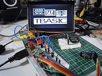  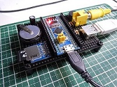 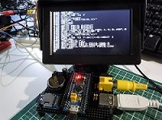  

本プログラムは、下記オリジナル版を[Arduino STM32](https://github.com/rogerclarkmelbourne/Arduino_STM32) 向けに移植・機能拡張版です.  
- オリジナル版配布サイト  
   https://github.com/vintagechips/ttbasic_arduino  
    関連情報 [電脳伝説 Vintagechips - 豊四季タイニーBASIC確定版](https://vintagechips.wordpress.com/2015/12/06/%E8%B1%8A%E5%9B%9B%E5%AD%A3%E3%82%BF%E3%82%A4%E3%83%8B%E3%83%BCbasic%E7%A2%BA%E5%AE%9A%E7%89%88/)

### 著作権について

**「豊四季 Tiny BASIC」**の著作権は開発者**のTetsuya Suzuki**氏にあります.  
プログラム利用については、オリジナル版の著作権者の配布条件に従うものとします.  
著作権者の同意なしに経済的な利益を得てはいけません.  
この条件のもとで、利用、複写、改編、再配布を認めます.    

### 関連ドキュメント
* 「豊四季タイニーBASIC for Arduino STM32」 インストール(旧)  
https://tamakichi.github.io/ttbasic_arduino_stm32/install.html  
* 「豊四季タイニーBASIC for Arduino STM32」 キーワード一覧(更新中)  
https://tamakichi.github.io/ttbasic_arduino_stm32/keyword.html  
* 「豊四季タイニーBASIC for Arduino STM32」 コマンドリファレンス(更新中)  
https://tamakichi.github.io/ttbasic_arduino_stm32/manual.html  

### システム構成
  

#### 構成組み合わせパターン

上記構成で表示機器は排他選択となります。次の構成にてシステムを組むことが出来ます。 

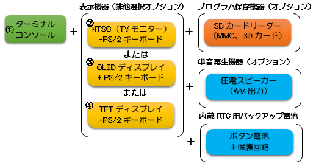  

##### 基本４構成の結線図

Blue Pillボードを利用した場合の上記①～④をベースとした結線図を示します。  
圧電スピーカーはオプションです。必要に応じて接続して下さい。  
RTC用バックアップ電池、SDカードモジュールも必要に応じて追加できます。  

###### ①ターミナルコンソール版

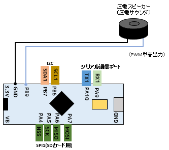 

###### ②NTSC版

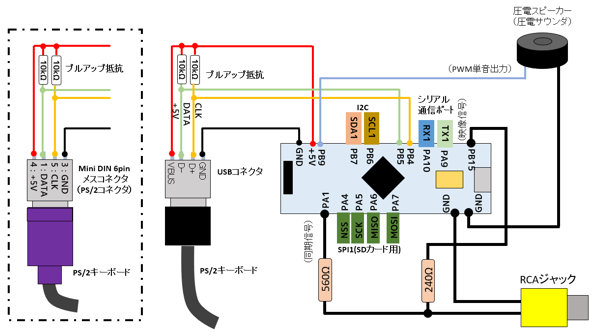  

###### ③OLED版

**(1)OLED I2Cインタフェース版**

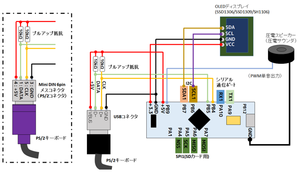 

**(2)OLED SPIインタフェース版**

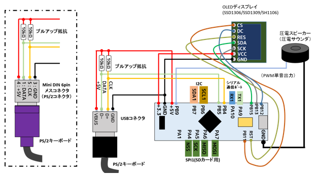 

④TFT(ILI9341 320x240ドット)版

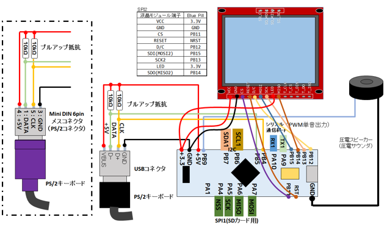 

##### SDカードモジュールオプション

  
※5V・3.3V変換レギュレータが乗っている製品の場合、VCCは5Vを供給しないと動作しない場合があります。

##### RTC用バックアップ電池  オプション

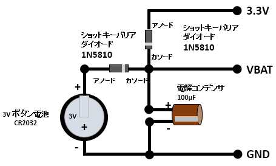  

#### ピン利用構成  

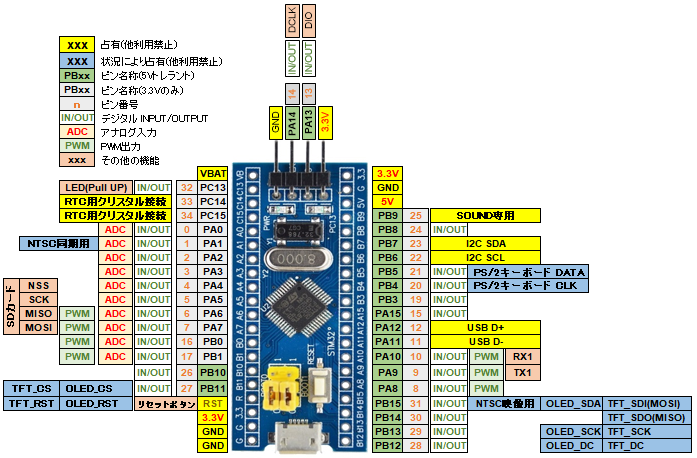  

#### ボート上のピン一覧

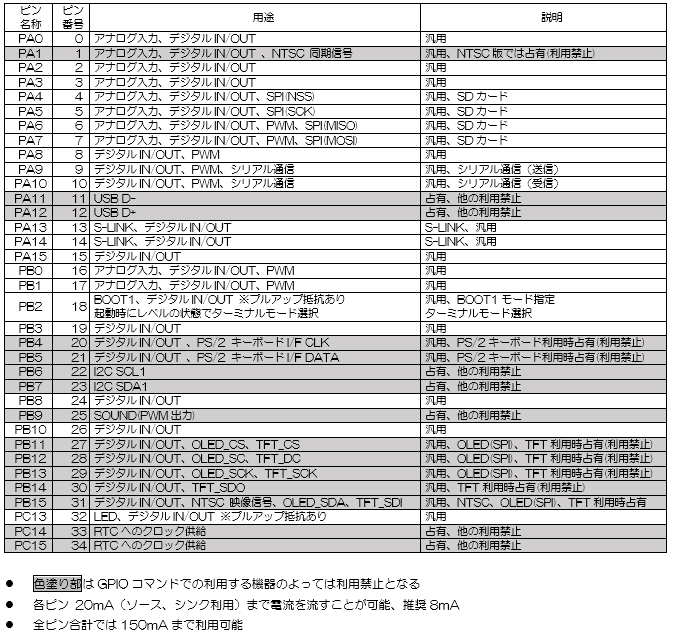 

#### 利用可能市販パーツ

- PS/2キーボード用コネクタ  
  ◾aitendo PS/2モジュール [ML-PS2-4P] http://www.aitendo.com/product/11377  
  ◾秋月電子 USBコネクタDIP化キット(Aメス) http://akizukidenshi.com/catalog/g/gK-07429/  

- NTSC用 RCAコネクタ  
  ◾aitendo TVOUTモジュールキット [K-TVOUT2R] http://www.aitendo.com/product/11740  
  ◾aitendo RCAモジュールキット [brebo.jam.rca] http://www.aitendo.com/product/12125  
  ◾秋月電子 RCAジャックDIP化キット(黄) http://akizukidenshi.com/catalog/g/gK-06522/  
  ※aitendo製品は付属抵抗を使うと若干出力電圧が上がりますが、許容範囲です。

- SDカードモジュール  
  amazon  
  ◾[EasyWordMall SDカードスロットソケットリーダーモジュールArduino用](https://www.amazon.co.jp/EasyWordMall-SD%E3%82%AB%E3%83%BC%E3%83%89%E3%82%B9%E3%83%AD%E3%83%83%E3%83%88%E3%82%BD%E3%82%B1%E3%83%83%E3%83%88%E3%83%AA%E3%83%BC%E3%83%80%E3%83%BC%E3%83%A2%E3%82%B8%E3%83%A5%E3%83%BC%E3%83%ABArduino%E7%94%A8/dp/B010PZZXNI/ref=cm_wl_huc_item)  
  ◾[Rasbee Micro SD/ TF カードモジュールシールド モジュール SPIインタフェース 1個](https://www.amazon.co.jp/Rasbee-Micro-%E3%82%AB%E3%83%BC%E3%83%89%E3%83%A2%E3%82%B8%E3%83%A5%E3%83%BC%E3%83%AB%E3%82%B7%E3%83%BC%E3%83%AB%E3%83%89-%E3%83%A2%E3%82%B8%E3%83%A5%E3%83%BC%E3%83%AB-SPI%E3%82%A4%E3%83%B3%E3%82%BF%E3%83%95%E3%82%A7%E3%83%BC%E3%82%B9/dp/B01KZBD6OA/ref=cm_wl_huc_item)  
  ◾[KKHMF マイクロSDストレージボード　TFカードシールドモジュール　SPIインタフェース Mega Due](https://www.amazon.co.jp/KKHMF-%E3%83%9E%E3%82%A4%E3%82%AF%E3%83%ADSD%E3%82%B9%E3%83%88%E3%83%AC%E3%83%BC%E3%82%B8%E3%83%9C%E3%83%BC%E3%83%89-TF%E3%82%AB%E3%83%BC%E3%83%89%E3%82%B7%E3%83%BC%E3%83%AB%E3%83%89%E3%83%A2%E3%82%B8%E3%83%A5%E3%83%BC%E3%83%AB-SPI%E3%82%A4%E3%83%B3%E3%82%BF%E3%83%95%E3%82%A7%E3%83%BC%E3%82%B9-Mega-Due/dp/B01G5AZ882/ref=cm_wl_huc_item)  
  ◾[ArduinoのためのマイクロSDカードモジュール](https://www.amazon.co.jp/GeeBot-Arduino%E3%81%AE%E3%81%9F%E3%82%81%E3%81%AE%E3%83%9E%E3%82%A4%E3%82%AF%E3%83%ADSD%E3%82%AB%E3%83%BC%E3%83%89%E3%83%A2%E3%82%B8%E3%83%A5%E3%83%BC%E3%83%AB/dp/B01GX126BU/ref=cm_wl_huc_item)  

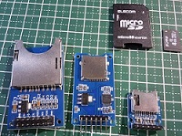  

- OLEDディスプレイモジュール(128x64ドット)  
  SSD1306、SSD1309、SH1106の３つのコントローラに対応  
  I2C、SPIに対応、サイズは1.3インチ以上を推奨  
  Aliexpress  
  ◾[1PCS 1.3" OLED module white color SPI 128X64 1.3 inch OLED](https://www.aliexpress.com/item/1PCS-1-3-OLED-module-white-color-SPI-128X64-1-3-inch-OLED-LCD-LED-Display/32681602908.html?spm=a2g0s.9042311.0.0.vs8i3e)  
  ◾[1PCS 1.3" OLED module white color I2C128X64 1.3 inch OLED](https://www.aliexpress.com/item/1PCS-1-3-OLED-module-white-color-128X64-1-3-inch-OLED-LCD-LED-Display-Module/32683739839.html?spm=a2g0s.9042311.0.0.vs8i3e)  

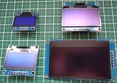 

- TFT(ILI9341)ディスプレイモジュール  
  320x240ドット SPI接続  
  amazon  
  ◾[HiLetgo 2.8 "TFT LCDディスプレイ タッチパネル SPIシリアル240 * 320 ILI9341 5V / 3.3V](https://www.amazon.co.jp/HiLetgo-LCD%E3%83%87%E3%82%A3%E3%82%B9%E3%83%97%E3%83%AC%E3%82%A4-%E3%82%BF%E3%83%83%E3%83%81%E3%83%91%E3%83%8D%E3%83%AB-SPI%E3%82%B7%E3%83%AA%E3%82%A2%E3%83%AB240-ILI9341/dp/B072N551V3/ref=cm_wl_huc_item)  
  ◾[ディスプレーモジュール，SODIAL(R)2.2" TFT LCDディスプレーモジュール基板](https://www.amazon.co.jp/%E3%83%87%E3%82%A3%E3%82%B9%E3%83%97%E3%83%AC%E3%83%BC%E3%83%A2%E3%82%B8%E3%83%A5%E3%83%BC%E3%83%AB%EF%BC%8CSODIAL-LCD%E3%83%87%E3%82%A3%E3%82%B9%E3%83%97%E3%83%AC%E3%83%BC%E3%83%A2%E3%82%B8%E3%83%A5%E3%83%BC%E3%83%AB%E5%9F%BA%E6%9D%BF-240x320-ILI9341-PIC%E3%81%AE%E3%81%9F%E3%82%81-%E8%B5%A4/dp/B01DXBI3I8/ref=cm_wl_huc_item)  

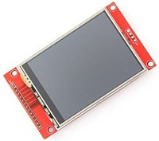 


### 本パッケージ・必要パッケージのダウンロードとインストール・配置
#### 本パッケージのダウンロードと配置
下記のリンクより直接ダウンロードして解凍、またはgitコマンドを使ってダウンロードして下さい。  

* ダウンロードリンク  
  https://github.com/Tamakichi/ttbasic_arduino_stm32/archive/master.zip

* gitを使ったダウンロード(複製のダウンロード)  
   ```
   git clone https://github.com/Tamakichi/ttbasic_arduino_stm32.git
   ```
  Windows 10へのgitの導入は、下記の手順を参考にして下さい。  
  * [git for Windowsのインストール手順](https://tamakichi.github.io/ttbasic_arduino_stm32/install_git.html)

ダウンロードした本パッケージのトップフォルダを 📁ttbasic_arduino_stm32\ とします。  
（解凍直後の *tbasic_arduino_stm32-master* から変更して下さい)  
トップフォルダを任意の場所に配置して下さい。  

#### 本パッケージの構成
📁ttbasic_arduino_stm32\  ・・・・ 本パッケージのトップフォルダ  
　📁bin\  ・・・・・・・・・・・・・コンパイル済みスケッチ(ファームウェア)  
　📁docs\  ・・・・・・・・・・・・ドキュメント類(作成中)  
　📁fontbin\  ・・・・・・・・・・・日本語フォント類  
　📁hardware\    ・・・・・・・・・・Arduino STM32パッケージ配置場所  
　📁libraries\   ・・・・・・・・・・・ スケッチ用ライブラリ  
　📁ttbasic\  ・・・・・・・・・・・ スケッチ本体  
　📄manual.pdf  ・・・・・・・・・・ マニュアル(旧)    
　📄platform.local.txt  ・・・・・・・ コンパイルオプション定義(OLEDコントローラ指定用)  
　📄README.md    ・・・・・・・・・ 本ドキュメント  
　📄TinyBASIC早見表.pdf  ・・・・・・ チートシート  
　📄キーワード.html  ・・・・・・・・キーワード一覧(コマンド簡易説明書HTML版)  
　📄キーワード..pdf  ・・・・・・・・・ キーワード一覧(コマンド簡易説明書PDF版)   

Arduino IDEでスケッチをコンパイルする場合は、  
Arduino IDEの環境設定の **スケッチブックの保存場所** に 📁ttbasic_arduino_stm32\ を
設定して下さい。  
これにより、既存の環境・ライブラリとの干渉減らすことが出来ます。  

#### Arduino STM32パッケージのダウンロードと配置
Arduino STM32パッケージは、随時更新されているため動作確認した時点のスナップショットに  
不具合修正を行った、下記のパッケージをダウンロードして利用して下さい。  

* ダウンロードリンク  
  https://github.com/Tamakichi/Arduino_STM32/archive/master.zip

* gitを使ったダウンロード(複製のダウンロード)  
   ```
   git clone https://github.com/Tamakichi/Arduino_STM32.git
   ```

ダウンロードしたArduino STM32パッケージのトップフォルダを 📁Arduino_STM32\ とします。  
（解凍直後の *Arduino_STM32-master* から変更して下さい)  

Arduino STM32パッケージのトップフォルダは、📁hardware\の下に配置して下さい。    
　📁ttbasic_arduino_stm32\  
　　📁hardware\  
　　　📁Arduino_STM32\

#### STM32用USBドライバのインストール(Windows10環境)
Arduino STM32パッケージに添付のUSBドライバをインストールします。  

下記の📁win\📄install_drivers.basをクリックしてドライバをインストールします。    
　📁ttbasic_arduino_stm32\  
　　📁hardware\  
　　　📁Arduino_STM32\  
　　　　📁drivers\  
　　　　　📁win\  
　　　　　　📄install_drivers.bas

#### Java(JRE)実行環境のインストール
Arduino STM32パッケージのボート書き込みツールはJavaの実行環境が必要です。  
Javaをインストールしていない場合は、インストールして下さい。  
* 無料Javaのダウンロード https://java.com/ja/download/

### コンパイル済みスケッチ(ファームウェア) の利用
コンパイル済みスケッチ(ファームウェア) を用意しています。  
ファームウェアを直接マイコンボードに書き込んで利用することが出来ます。  

プロジェクトファイルの**binフォルダ**に２つのタイプのファームウェアを用意しています。

1. ブートローダー無しファームウェア(バイナリー形式)  
📁ttbasic_arduino_stm32\  
　📁bin\  
　　📄black_medium_small_square:ttbasic_NTSC.bin	(NTSCビデオ出力版)  
　　📄black_medium_small_square:ttbasic_OLED_SH1106_I2C.bin	(OLED SH1106 I2C版)  
　　📄black_medium_small_square:ttbasic_OLED_SH1106_SPI.bin	(OLED SH1106 SPI版)  
　　📄black_medium_small_square:ttbasic_OLED_SSD1306_I2C.bin (OLEDSSD1306/SSD1309 I2C版)  
　　📄black_medium_small_square:ttbasic_OLED_SSD1306_SPI.bin (OLED SSD1306/SSD1309 SPI版)  
　　📄black_medium_small_square:ttbasic_Serial.bin (シリアルコンソール版)  
　　📄black_medium_small_square:ttbasic_TFT.bin	(TFT ILI9341版)  

2. ブートローダー付きファームウェア(バイナリー形式)  
📁ttbasic_arduino_stm32\  
　📁bin\PlusBootloader\  
　　📄boot_ttbasic_NTSC.bin	(NTSCビデオ出力版)  
　　📄boot_ttbasic_OLED_SH1106_I2C.bin (OLED SH1106 I2C版)  
　　📄boot_ttbasic_OLED_SH1106_SPI.bin (OLED SH1106 SPI版)  
　　📄boot_ttbasic_OLED_SSD1306_I2C.bin (OLED SSD1306/SSD1309 I2C版)  
　　📄boot_ttbasic_OLED_SSD1306_SPI.bin (OLED SSD1306/SSD1309 SPI版)  
　　📄boot_ttbasic_Serial.bin	(ターミナルコンソール版)  
　　📄boot_ttbasic_TFT.bin (TFT ILI9341版)  

#### ブートローダー無しファームウェア(バイナリー形式)の書込み手順(Windows10環境)
利用するマイコンボードにArduino STM32用のブートローダーが書き込まれている必要があります。  
BluePillボードへの書き込みは下記の記事等を参考して行って下さい。  

* [BluePillボードへのブートローダの書き込み(本パッケージ添付ドキュメント)](https://tamakichi.github.io/ttbasic_arduino_stm32/install.html#_bluepillボードへのブートローダの書き込み)
* DEKOのアヤシいお部屋-「STM32F103C8T6」http://ht-deko.com/arduino/stm32f103c8t6.html  

##### ファームウェア書込み手順
1. `ttwrite.bat`の修正  
   ```
   set dev=COM4
   ・・・
   ```
   `dev`にマイコンボードのUSBポートが利用するシリアルポートを指定します。  
   `COM`は必ず半角大文字で記述して下さい。  

2. コマンドプロンプト上でコマンド実行  
   コマンドプロンプトを起動します。  
   📁ttbasic_arduino_stm32\📁bin\ に移動し、次のコマンドを実行します。  

   ```
   ttwrite ブートローダー無しファームウェアファイル
   ```
    指定する **ブートローダー無しファームウェアファイル** は各自の利用目的に応じて選択して下さい。  

   `ttwrite ttbasic_TFT.bin`を実行した例：  
   ```
   ttwrite ttwrite ttbasic_TFT.bin
   ```

   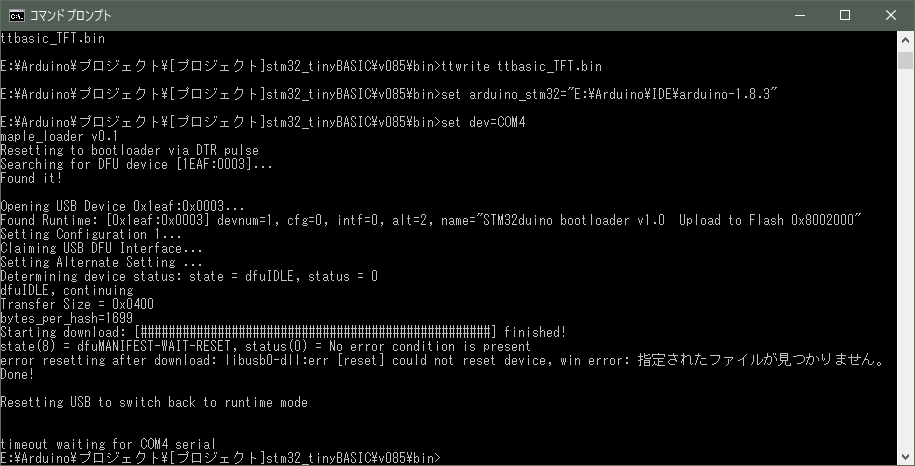  

   コマンド実行しても書き込みが開始されない場合、ボード上のリセットボタンを押すことで、  
   ブートローダーが強制的に書込みモードに切り替わります。試してみて下さい。  


   別の方法として、エクスプローラー上で`ttwrite.bat`アイコン上に**ブートローダー無しファームウェアファイル**のアイコンをドラック＆ドロップすることで書き込むことが出来ます。  

   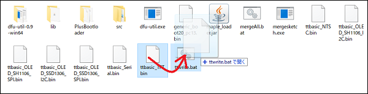   

#### ブートローダー付きファームウェア(バイナリー形式) の書込み手順

ブートローダーと同じ方法で書き込むこと出来ます。  
(プログラマST-LINKのを使って、STM32 ST-LINK Utilityで書き込み)  

ここでは添付のttbtwrite.batコマンドを使ったシリアル接続による方法を説明します。  

##### 事前準備
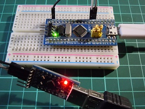 

1. USB-シリアル変換モジュールを用意して下さい。  
  パソコンに接続してシリアルポートを確認します。  
  ここでは、COM5とします。

2. 添付の書込み用バッチファイルttbtwrite.batを各自の環境に合わせて修正します。  
📁bin\PlusBootloader\  
　📄stm32flash.exe ・・ stm32flash(Arduino STM32に付属のもとの同じプログラムです)  
　📄ttbtwrite.bat   ・・・ 書込み用バッチファイル  

   ```
   set dev=COM5
   stm32flash.exe -b 115200 -f -v -w %1 %dev%
   ```
   devのシリアルポートの指定を各自の環境に合わせて変更して下さい。  

3. BluePillボードのUSBポートを電源供給を兼ねてパソコンに接続します。  
4. USB-シリアル変換モジュールとBlue Pillボード結線します。  　

   | USB-シリアル変換モジュール | Blue Pillボード |
   | :-------------: | :----------: |
   |       GND       |     GND      |
   |       TXD       |     A10      |
   |       RXD       |      A9      |

5. ジャンパースイッチの設定ボード上のBOOT0ジャンパを1に設定します。  
   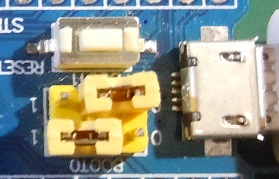   
   **BOOT0**：1  
   **BOOT1**：0  

##### 書込み作業
コマンドプロンプトを実行します。  
**ttbtwrite.bat**のある📁bin\PlusBootloader\ に移動し、次のコマンドを実行します。  
```
ttbtwrite ブートローダー付きファームウェアファイル
```
**ブートローダー付きファームウェアファイル**は同じフォルダ内にあります。  
各自の用途に合わせて指定して下さい。  

`ttbtwrite boot_ttbasic_Serial.bin` を実行した例：  
```
ttbtwrite ttbtwrite boot_ttbasic_Serial.bin
```
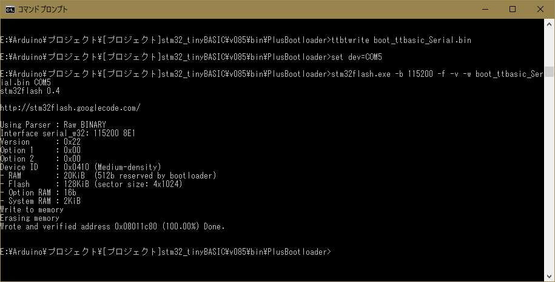 

書込みはエクスプローラー上で**ブートローダー付きファームウェアファイル**のアイコンを**ttbtwrite.bat**のアイコンにドラック＆ドロップする操作でも行うことが出来ます。  
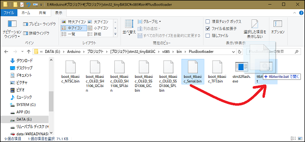   

書込みが完了したら、BOOT0ジャンバを0に戻して下さい。  

### スケッチの書込み手順
スケッチをコンパイルして書き込む場合の手順です。  
スケッチは下記のフォルダのttbasic.inoが本体です。      
　📁ttbasic_arduino_stm32\
　　📁ttbasic\
　　　📄ttbasic.ino

#### 事前準備
1. Arduino IDEのスケッチ保存場所の設定  
  Arduino IDEの環境設定の **スケッチブックの保存場所** に 
  📁ttbasic_arduino_stm32\ を設定して下さい。  
  設定反映のため一旦Arduino IDE終了し、再度Arduino IDEを起動して下さい。

2. Arduino IDEのボードマネージャにて  
「Arduino SAMD Boards (32-bits ARM Coetex-M0+) by Arduino」の  
最新版をインストールして下さい。

3. Arduino IDEのボードの設定  
Arduinoのメニューでボードの設定を行います。  
    * ボード： Generic STM32F103C series  
    * Variant： Generic STM32F103C8(20k RAM 128k Flash)  
    * Upload method： STM32duino bootloader  
    * CPU Speed： 72MHz
    * Optimize： Smallest
    * Upload method: "STM32duino bootloader" ※各自環境に合わせて任意  
    * シリアルポート: ※各自環境に合わせて任意  

4. STM32用USBドライバをインストールしているものとします。

上記の設定の詳細については、本パッケージ添付の下記のドキュメントも参照下さい。
* [Arduino IDEの環境設定](https://tamakichi.github.io/ttbasic_arduino_stm32/install.html#_arduino_ide%E3%81%AE%E7%92%B0%E5%A2%83%E8%A8%AD%E5%AE%9A)

#### システム構成別の修正

デフォルトでは、**基本4構成の②NTSC版(SDカードあり)の設定**となっています。  
異なるシステム構成で利用する場合は、それぞれに必要な修正を行って下さい。

##### ①ターミナルコンソール版
1. `tconfig.h`の修正
- ` USE_SCREEN_MODE`の値`1`を`0`に変更して下さい.
  ```
  #define USE_SCREEN_MODE 0 //※デバイススクリーン利用の場合、1を指定する (デフォルト:1)
  ```
- `USE_NTSC`の値`1`を`0`に変更して下さい.
  ```
  #define USE_NTSC  1  // 0:利用しない 1:利用する (デフォルト:1)
  ```

##### ②OLED版
1. `tconfig.h`の修正
- `USE_NTSC`の値`1`を`0`に変更して下さい.  
  ````
  #define USE_NTSC  0  // 0:利用しない 1:利用する (デフォルト:1)
  ````
 - `USE_OLED`の値`0`を`1`に変更して下さい.  
   `OLED_IFMODE`の値をI2C接続の場合`0`、SPI接続の場合`1`を指定して下さい.  
   必要に応じて、画面の向き`OLED_RTMODE`を変更して下さい。  

     ````cpp
   #define USE_OLED     1 // 0:利用しない 1:利用する (デフォルト:0)
                         // 利用時は USE_NTSC を0にすること
   #define OLED_IFMODE 1 // OLED接続モード(0:I2C 1:SPI デオフォルト:1 )
   #define OLED_SCMODE 1 // スクリーンモード(1～6 デオフォルト:1 )
   #define OLED_RTMODE 0 // 画面の向き (0～3: デフォルト: 0)
     ````

2. **コントローラの選択**  
   デフォルトでは、SH1106 対応となっています。  
   利用するコントローラをSSD1306/SSD1309に変更する場合、  
   利用するライブラリを切り替える必要があります。  
   この切り替えは、Arduinoのコンパイル条件指定を行う **platform.local.txt**
   ファイルにて指定します。

   本パッケージ添付の  **platform.local.txt** ファイル   
  📁ttbasic_arduino_stm32\   
  　📄platform.local.txt

   を下記のフォルダに配置して下さい(STM32F1の下)  
  📁ttbasic_arduino_stm32\  
  　📁hardware\  
  　　📁Arduino_STM32\  
  　　　📁STM32F1\  
  　　　　📄platform.local.txt
  
    **platform.local.txt** は次のような定義となっています。  
     ```TXT
    # These can be overridden in platform.local.txt
    # OLED_DEV: 0 SH1106、 1 SSD1306/SSD1309
    compiler.c.extra_flags=-DOLED_DEV=1
    compiler.cpp.extra_flags=-DOLED_DEV=1
     ```
    OLED_DEVの値を変更することでもSH1106、SSD1306/SSD1309の切り替えを行うことが出来ます。  

##### ③TFT(ILI9341 320x240ドット)版  
1. `tconfig.h`の修正  
  `USE_NTSC`の値`1`を`0`に変更して下さい.  
      ```cpp
    #define USE_NTSC  0  // 0:利用しない 1:利用する (デフォルト:1)
      ```

    `USE_TFT`の値`0`を`1`に修正して下さい.  
    必要に応じて、画面の向き`TFT_RTMODE`を変更して下さい。  

    ```CPP
    #define USE_TFT     1 // 0:利用しない 1:利用する (デフォルト:0)
                          // 利用時は USE_NTSC を0にすること
    #define TFT_SCMODE 1  // スクリーンモード(1～6 デオフォルト:1 )
    #define TFT_RTMODE 3  // 画面の向き (0～3: デフォルト: 3)
    ```

#### スケッチの書込み
Arduno IDEの「⇒」アイコンまたは、メニュー [スケッチ] > [マイコンボードに書き込む]にて  
スケッチを書き込みます。

#### 日本語フォントの利用
V0.87より、SDカードに配置した日本語フォントを利用するためのコマンドを追加しました。  
専用コマンドにより、フォントデータの参照、全角文字列の描画を行うことが出来ます。  

##### 利用するための設定
ダウンロードしたパッケージに添付の下記のフォントデータ**SFONT.BIN**を  
SDカートのトップのディレクトリに配置して下さい。

📁ttbasic_arduino_stm32\  ・・・・ 本パッケージのトップフォルダ  
　📁fontbin\  ・・・・・・・・・・・日本語フォント類  
  　📄SFONT.BIN ・・・・・・・・・・  フォントデータ  
  　📄SFONTLCD.BIN ・・・・・・・・ フォントデータ(LCD用)


日本語（全角）コードはシフトJISコードを採用しています。  
日本語（全角）文字列の入力は、WindowsのTeraTerm等のターミナルコンソールにて入力して下さい。  
NTSC、OLED、TFT画面のテキストスクリーンエディタでの日本語表示には対応していません。  

### サンプルプログラム
#### ボード上のLEDの点滅  
```
10 P=PC13
20 GPIO P,OUTPUT
30 OUT P,HIGH
40 FOR I=1 TO 10
50 OUT P,LOW
60 WAIT 300
70 OUT P,HIGH
80 WAIT 300
90 NEXT I
```

#### アナログ値表示
```
10 CLS
20 GPIO PB1,ANALOG
30 A=ANA(PB1)
40 LOCATE 5,5: ? A; "     "
50 GOTO 30
```
#### 配列の連続設定
```
10 @(1)=1,2,3,4,5,6,7,8
20 FOR I=1 TO 8
30 ? "@(";I;")=";@(I)
40 NEXT I
```

#### シフト演算
```
10 A=1
20 FOR I=0 TO 16
30 ? HEX$(A<<I,4)
40 NEXT I
```

#### ラベルの利用
```
100 GOSUB "SUB01"
110 GOSUB "SUB02"
120 N=0
130 "LOOP"
140 PRINT "N=";N
150 N=N+1:IF N<5 GOTO "LOOP"
160 END
170 "SUB01"
180 PRINT "SUB01"
190 RETURN
200 "SUB02"
210 PRINT "SUB02"
220 RETURN
```

#### 日本語フォント表示
```
1'12ﾄﾞｯﾄﾌｫﾝﾄﾋｮｳｼﾞ
10 GCLS
20 SETKANJI 12,1,0,0,GW-1
30 KANJI 0,0,"豊四季タイニーBASIC for Arduino STM32 V0.87では、日本語表示が可能です。"
```

## 以降はオリジナルのドキュメントです


TOYOSHIKI Tiny BASIC for Arduino

The code tested in Arduino Uno R3.<br>
Use UART terminal, or temporarily use Arduino IDE serial monitor.

Operation example

&gt; list<br>
10 FOR I=2 TO -2 STEP -1; GOSUB 100; NEXT I<br>
20 STOP<br>
100 REM Subroutine<br>
110 PRINT ABS(I); RETURN

OK<br>
&gt;run<br>
2<br>
1<br>
0<br>
1<br>
2

OK<br>
&gt;

The grammar is the same as<br>
PALO ALTO TinyBASIC by Li-Chen Wang<br>
Except 3 point to show below.

(1)The contracted form of the description is invalid.

(2)Force abort key<br>
PALO ALTO TinyBASIC -> [Ctrl]+[C]<br>
TOYOSHIKI TinyBASIC -> [ESC]<br>
NOTE: Probably, there is no input means in serial monitor.

(3)Other some beyond my expectations.

(C)2012 Tetsuya Suzuki<br>

