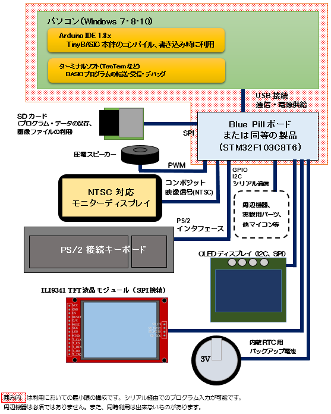

## 豊四季タイニーBASIC for Arduino STM32V0.86a/n

（注意）V0.85β版までは、下記のリポジトリにて管理しています。  
Tamakichi/ttbasic_arduino  https://github.com/Tamakichi/ttbasic_arduino  

Issues、Projects機能利用のため、本家からリポジトリ管理を切り離しました。  

     

本プログラムは、下記オリジナル版を[Arduino STM32](https://github.com/rogerclarkmelbourne/Arduino_STM32) 向けに移植・機能拡張版です.  

- オリジナル版配布サイト  
   https://github.com/vintagechips/ttbasic_arduino  
    関連情報 [電脳伝説 Vintagechips - 豊四季タイニーBASIC確定版](https://vintagechips.wordpress.com/2015/12/06/%E8%B1%8A%E5%9B%9B%E5%AD%A3%E3%82%BF%E3%82%A4%E3%83%8B%E3%83%BCbasic%E7%A2%BA%E5%AE%9A%E7%89%88/)

### 著作権について

**「豊四季 Tiny BASIC」**の著作権は開発者**のTetsuya Suzuki**氏にあります.  
プログラム利用については、オリジナル版の著作権者の配布条件に従うものとします.  
著作権者の同意なしに経済的な利益を得てはいけません.  
この条件のもとで、利用、複写、改編、再配布を認めます.    


### システム構成

  

#### 構成組み合わせパターン

上記構成で表示機器は排他選択となります。次の構成構成にてシステムを組むことが出来ます。 

  

##### 基本４構成の結線図

Blue Pillボードを利用した場合の上記①～④をベースとした結線図を示します。  
圧電スピーカーはオプションです。必要に応じて接続して下さい。  
RTC用バックアップ電池、SDカードモジュールも必要に応じて追加できます。  

###### ①ターミナルコンソール版

 

###### ②NTSC版

  

###### ③OLED版

**(1)OLED I2Cインタフェース版**

 

**(2)OLED SPIインタフェース版**

 

④TFT(ILI9341 320x240ドット)版

 

##### SDカードモジュールオプション

  
※5V・3.3V変換レギュレータが乗っている製品の場合、VCCは5Vを供給しないと動作しない場合があります。

##### RTC用バックアップ電池  オプション

  

    

#### ピン利用構成  

  


#### ボート上のピン一覧

 

#### 利用可能市販パーツ

- PS/2キーボード用コネクタ  
  ◾aitendo PS/2モジュール [ML-PS2-4P] http://www.aitendo.com/product/11377  
  ◾秋月電子 USBコネクタDIP化キット(Aメス) http://akizukidenshi.com/catalog/g/gK-07429/  

- NTSC用 RCAコネクタ  
  ◾aitendo TVOUTモジュールキット [K-TVOUT2R] http://www.aitendo.com/product/11740  
  ◾aitendo RCAモジュールキット [brebo.jam.rca] http://www.aitendo.com/product/12125  
  ◾秋月電子 RCAジャックDIP化キット(黄) http://akizukidenshi.com/catalog/g/gK-06522/  
  ※aitendo製品は付属抵抗を使うと若干出力電圧が上がりますが、許容範囲です。

- SDカードモジュール  
  amazon  
  ◾[EasyWordMall SDカードスロットソケットリーダーモジュールArduino用](https://www.amazon.co.jp/EasyWordMall-SD%E3%82%AB%E3%83%BC%E3%83%89%E3%82%B9%E3%83%AD%E3%83%83%E3%83%88%E3%82%BD%E3%82%B1%E3%83%83%E3%83%88%E3%83%AA%E3%83%BC%E3%83%80%E3%83%BC%E3%83%A2%E3%82%B8%E3%83%A5%E3%83%BC%E3%83%ABArduino%E7%94%A8/dp/B010PZZXNI/ref=cm_wl_huc_item)  
  ◾[Rasbee Micro SD/ TF カードモジュールシールド モジュール SPIインタフェース 1個](https://www.amazon.co.jp/Rasbee-Micro-%E3%82%AB%E3%83%BC%E3%83%89%E3%83%A2%E3%82%B8%E3%83%A5%E3%83%BC%E3%83%AB%E3%82%B7%E3%83%BC%E3%83%AB%E3%83%89-%E3%83%A2%E3%82%B8%E3%83%A5%E3%83%BC%E3%83%AB-SPI%E3%82%A4%E3%83%B3%E3%82%BF%E3%83%95%E3%82%A7%E3%83%BC%E3%82%B9/dp/B01KZBD6OA/ref=cm_wl_huc_item)  
  ◾[KKHMF マイクロSDストレージボード　TFカードシールドモジュール　SPIインタフェース Mega Due](https://www.amazon.co.jp/KKHMF-%E3%83%9E%E3%82%A4%E3%82%AF%E3%83%ADSD%E3%82%B9%E3%83%88%E3%83%AC%E3%83%BC%E3%82%B8%E3%83%9C%E3%83%BC%E3%83%89-TF%E3%82%AB%E3%83%BC%E3%83%89%E3%82%B7%E3%83%BC%E3%83%AB%E3%83%89%E3%83%A2%E3%82%B8%E3%83%A5%E3%83%BC%E3%83%AB-SPI%E3%82%A4%E3%83%B3%E3%82%BF%E3%83%95%E3%82%A7%E3%83%BC%E3%82%B9-Mega-Due/dp/B01G5AZ882/ref=cm_wl_huc_item)  
  ◾[ArduinoのためのマイクロSDカードモジュール](https://www.amazon.co.jp/GeeBot-Arduino%E3%81%AE%E3%81%9F%E3%82%81%E3%81%AE%E3%83%9E%E3%82%A4%E3%82%AF%E3%83%ADSD%E3%82%AB%E3%83%BC%E3%83%89%E3%83%A2%E3%82%B8%E3%83%A5%E3%83%BC%E3%83%AB/dp/B01GX126BU/ref=cm_wl_huc_item)  

  

- OLEDディスプレイモジュール(128x64ドット)  
  SSD1306、SSD1309、SH1106の３つのコントローラに対応  
  I2C、SPIに対応、サイズは1.3インチ以上を推奨  
  Aliexpress  
  ◾[1PCS 1.3" OLED module white color SPI 128X64 1.3 inch OLED](https://www.aliexpress.com/item/1PCS-1-3-OLED-module-white-color-SPI-128X64-1-3-inch-OLED-LCD-LED-Display/32681602908.html?spm=a2g0s.9042311.0.0.vs8i3e)  
  ◾[1PCS 1.3" OLED module white color I2C128X64 1.3 inch OLED](https://www.aliexpress.com/item/1PCS-1-3-OLED-module-white-color-128X64-1-3-inch-OLED-LCD-LED-Display-Module/32683739839.html?spm=a2g0s.9042311.0.0.vs8i3e)  

 

- TFT(ILI9341)ディスプレイモジュール  
  320x240ドット SPI接続  
  amazon  
  ◾[HiLetgo 2.8 "TFT LCDディスプレイ タッチパネル SPIシリアル240 * 320 ILI9341 5V / 3.3V](https://www.amazon.co.jp/HiLetgo-LCD%E3%83%87%E3%82%A3%E3%82%B9%E3%83%97%E3%83%AC%E3%82%A4-%E3%82%BF%E3%83%83%E3%83%81%E3%83%91%E3%83%8D%E3%83%AB-SPI%E3%82%B7%E3%83%AA%E3%82%A2%E3%83%AB240-ILI9341/dp/B072N551V3/ref=cm_wl_huc_item)  
  ◾[ディスプレーモジュール，SODIAL(R)2.2" TFT LCDディスプレーモジュール基板](https://www.amazon.co.jp/%E3%83%87%E3%82%A3%E3%82%B9%E3%83%97%E3%83%AC%E3%83%BC%E3%83%A2%E3%82%B8%E3%83%A5%E3%83%BC%E3%83%AB%EF%BC%8CSODIAL-LCD%E3%83%87%E3%82%A3%E3%82%B9%E3%83%97%E3%83%AC%E3%83%BC%E3%83%A2%E3%82%B8%E3%83%A5%E3%83%BC%E3%83%AB%E5%9F%BA%E6%9D%BF-240x320-ILI9341-PIC%E3%81%AE%E3%81%9F%E3%82%81-%E8%B5%A4/dp/B01DXBI3I8/ref=cm_wl_huc_item)  

 

### ファームウェア書込み手順(Windows 10の場合)  
プロジェクトファイルの**binフォルダ**に次の２つのタイプのファームウェアを用意しています。

1. ブートローダー無しファームウェア(バイナリー形式)  
  📁bin\  
  ◾black_medium_small_square:ttbasic_NTSC.bin				・・・ NTSCビデオ出力版  
  ◾black_medium_small_square:ttbasic_OLED_SH1106_I2C.bin	・・・ OLED(SH1106 I2C接続)版  
  ◾black_medium_small_square:ttbasic_OLED_SH1106_SPI.bin	・・・ OLED(SH1106 SPI接続)版  
  ◾black_medium_small_square:ttbasic_OLED_SSD1306_I2C.bin	・・・ OLED(SSD1306/SSD1309 I2C接続)版  
  ◾black_medium_small_square:ttbasic_OLED_SSD1306_SPI.bin	・・・ OLED(SSD1306/SSD1309 SPI接続)版  
  ◾black_medium_small_square:ttbasic_Serial.bin				・・・ ターミナルコンソール版  
  ◾black_medium_small_square:ttbasic_TFT.bin					・・・ TFT(ILI9341))版  

2. ブートローダー付きファームウェア(バイナリー形式)  
  📁bin\PlusBootloader\  
  ◾boot_ttbasic_NTSC.bin			・・・ NTSCビデオ出力版  
  ◾boot_ttbasic_OLED_SH1106_I2C.bin・・・ OLED(SH1106 I2C接続)版  
  ◾boot_ttbasic_OLED_SH1106_SPI.bin・・・ OLED(SH1106 SPI接続)版  
  ◾boot_ttbasic_OLED_SSD1306_I2C.bin・・・ OLED(SSD1306/SSD1309 I2C接続)版  
  ◾boot_ttbasic_OLED_SSD1306_SPI.bin・・・ OLED(SSD1306/SSD1309 SPI接続)版  
  ◾boot_ttbasic_Serial.bin			・・・ ターミナルコンソール版  
  ◾boot_ttbasic_TFT.bin			・・・ TFT(ILI9341))版  

この書き込み方法について説明します.  


#### ブートローダー無しファームウェア(バイナリー形式)の書込み手順

ブートローダーを利用したUSB経由によるファームウェアの書込みを行います。  
利用するマイコンボードにはArduino STM32用のブートローダーが書き込まれている必要があります。  

##### 事前準備

「豊四季Tiny BASIC for Arduino STM32」ファームウェアの書込みには、  

- **事前にArduino STM32環境を導入し、付随するUSBドライバをインストール等が必要です.**  

- **Blue Pillボード(または他のSTM32F103C8T6ボード)ブートローダを書きこんでおく必要があります.**  

  このあたりの設定は、DEKOさんがまとめました記事が参考になると思います.  
  (素晴らしいまとめの公開に感謝!!)  
  DEKOのアヤシいお部屋-「STM32F103C8T6」 - http://ht-deko.com/arduino/stm32f103c8t6.html  


- **Arduino STM32モジュールは下記の安定版 を使って下さい**  
  https://github.com/rogerclarkmelbourne/Arduino_STM32/releases/tag/R20170323  

##### 書込み作業

1. ブロジェクト一式のダウンロード  

   プロジェクト一式をダウンロードし、解凍した中のフォルダ**bin**内のフォルダを開いて下さい.  
     

2. `ttwrite.bat`の修正  

   ```
   set arduino_stm32="E:\Arduino\IDE\arduino-1.8.3"
   set dev=COM4
   ・・・
   ```

   `arduino_stm32`にArduino IDEのインストールパスを指定します。  
   Javaをインストールしている場合は、ブランク指定：`set arduino_stm32=`でも可能です。  

   `dev`にマイコンボードのUSBポートが利用するシリアルポートを指定します。`COM`は必ず半角大文字で記述して下さい。  


3. コマンドプロンプト上でコマンド実行  

   コマンドプロンプトを実行します。  
   上記のフォルダ**bin**に移動し、次のコマンドを実行します。  

   ```
   ttwrite ブートローダー無しファームウェアファイル
   ```

    指定する **ブートローダー無しファームウェアファイル** は各自の利用環境に合うものを指定して下さい。  

   `ttwrite ttbasic_TFT.bin`を実行した例：  

     

   コマンド実行しても書き込みが開始されない場合、ボード上のリセットボタンを押すことで、  
   ブートローダーが強制的に書込みモードに切り替わります。試してみて下さい。  


   別の方法として、エクスプローラー上で`ttwrite.bat`アイコン上に**ブートローダー無しファームウェアファイル**のアイコンをドラック＆ドロップすることで書き込むことが出来ます。  

      

#### ブートローダー付きファームウェア(バイナリー形式) の書込み手順

ブートローダーと同じ方法で書き込みます。  
ここではstm32flash.exeコマンドを使ったシリアル接続による方法を説明します。  

 

本方法及び本方法以外の方法、Windows以外の環境での書き込み方法については、  
下記のサイト掲載の手順を参考にして下さい。  
　DEKOのアヤシいお部屋-「STM32F103C8T6」 - http://ht-deko.com/arduino/stm32f103c8t6.html  

##### 事前準備

1. USB-シリアル変換モジュールを用意して下さい。  

2. 添付の書込み用バッチファイルttbtwrite.batを各自の環境に合わせて修正します。  
   📁bin\PlusBootloader  
    　◾stm32flash.exe      ・・・  stm32flash(Arduino STM32に付属のもとの同じプログラムです)  
   　 ◾ttbtwrite.bat 　      ・・・  書込み用バッチファイル  

   ```
   set dev=COM5
   stm32flash.exe -b 115200 -f -v -w %1 %dev%
   ```

   devのシリアルポートの指定を各自の環境に合わせて変更して下さい。  


3. USBケーブルは電源供給を兼ねてパソコンに接続します。  

4. USB-シリアル変換モジュールとBlue Pillボードの結線  

   | USB-シリアル変換モジュール | Blue Pillボード |
   | :-------------: | :----------: |
   |       GND       |     GND      |
   |       TXD       |     A10      |
   |       RXD       |      A9      |


5. ジャンパースイッチの設定ボード上のBOOT0ジャンパを1に設定します。  

    

   **BOOT0**：1  
   **BOOT1**：0  


##### 書込み作業

コマンドプロンプトを実行します。  
**ttbtwrite.bat**のあるフォルダ**bin\PlusBootloader**に移動し、次のコマンドを実行します。  

```
ttbtwrite ブートローダー付きファームウェアファイル
```

**ブートローダー付きファームウェアファイル**は同じフォルダ内にあります。  
各自の用途に合わせて指定して下さい。  

`ttbtwrite boot_ttbasic_Serial.bin` を実行した例：  

 

書込みはエクスプローラー上で**ブートローダー付きファームウェアファイル**のアイコンを**ttbtwrite.bat**のアイコンにドラック＆ドロップする操作でも行うことが出来ます。  

   

書込みが完了したら、BOOT0ジャンバを0に戻して下さい。  


### スケッチの書込み手順

スケッチをコンパイルして書き込む場合の手順です。  
    

#### 事前準備

1. 「ファームウェア書込み手順(Windows 10の場合)」の「事前準備」と同じ準備を行って下さい.  

2. プロジェクトファイルのダウンロードと配置  

  1) プロジェクト一式をダウンロードし、解凍した中の、フォルダ**libraries**内のフォルダを  
  各自のArduino環境のライブラリ配置ディレクトリ**libraries**に配置して下さい.  
    

  添付のSDライブラリは既存のSDライブラリの修正版です.  
  Arduino STM32環境でのみ利用する場合は、STM32F1\librariesの方に配置して下さい.  

  添付ライブラリは、Arduino STM32環境に依存するライブラリを含むため、  
  下記のディレクトリの配置でも良いです.  
  (古いバージョンのArduino IDEと共存利用している環境では競合等回避のためここへの配置を推奨）  
  \hardware\Arduino_STM32\STM32F1\libraries  
  添付ライブラリの個別利用・入手は下記のリンクを参照して下さい.      

  2)スケッチ本体のフォルダ**ttbasic**を各自のスケッチ配置フォルダの配置  

3. Arduino STM32に関する設定  

   安定版と最新版に対応しています。  

   - 安定版 ：https://github.com/rogerclarkmelbourne/Arduino_STM32/releases/tag/R20170323 
   - 最新版（オリジナル版）：https://github.com/rogerclarkmelbourne/Arduino_STM32  
   - 最新版（動作確認時スナップショット＋修正）： https://github.com/Tamakichi/Arduino_STM32  

   デフォルトでは、最新版に対応しています。  
   安定版を利用する場合は、条件付きコンパイル指定の**STM32_R20170323**の定義が必要となります。  
   インストールしたArduino STM32パッケージの **\hardware\Arduino_STM32\STM32F1\ **に  
   **platform.local.txt**を配置し、次の定義を行って下さい。  

````TXT
compiler.c.extra_flags=-DSTM32_R20170323
compiler.cpp.extra_flags=-DSTM32_R20170323
````

**platform.local.txt**は本リポジトリに添付の[platform.local.txt](https://github.com/Tamakichi/ttbasic_arduino_stm32/blob/master/platform.local.txt) ファイルを修正して配置しても良いです。


#### システム構成別の修正

デフォルトでは、**基本4構成の②NTSC版(SDカードあり)の設定**となっています。
異なるシステム構成で利用する場合は、それぞれに必要な修正を行って下さい。

##### ①ターミナルコンソール版

1. `tconfig.h`の修正

- ` USE_SCREEN_MODE`の値`1`を`0`に変更して下さい.

  ```
  #define USE_SCREEN_MODE 0 //※デバイススクリーン利用の場合、1を指定する (デフォルト:1)
  ```

- `USE_NTSC`の値`1`を`0`に変更して下さい.

  ```
  #define USE_NTSC  1  // 0:利用しない 1:利用する (デフォルト:1)
  ```

##### ②OLED版

1. ###### `tconfig.h`の修正

- `USE_NTSC`の値`1`を`0`に変更して下さい.  

  ````
  #define USE_NTSC  0  // 0:利用しない 1:利用する (デフォルト:1)
  ````

 - `USE_OLED`の値`0`を`1`に変更して下さい.  
   `OLED_IFMODE`の値をI2C接続の場合`0`、SPI接続の場合`1`を指定して下さい.  
   必要に応じて、画面の向き`OLED_RTMODE`を変更して下さい。  

     ````cpp
   #define USE_OLED     1 // 0:利用しない 1:利用する (デフォルト:0)
                         // 利用時は USE_NTSC を0にすること
   #define OLED_IFMODE 1 // OLED接続モード(0:I2C 1:SPI デオフォルト:1 )
   #define OLED_SCMODE 1 // スクリーンモード(1～6 デオフォルト:1 )
   #define OLED_RTMODE 0 // 画面の向き (0～3: デフォルト: 0)
     ````

2. ###### **コントローラの指定**

   デフォルトでは、SH1106 対応となっています。  

   コントローラ指定 定数 **OLED_DEV** にてコントローラの選択が出来ます。
   SSD1306、SSD1309 を利用する場合は、次の設定を行って下さい。

   インストールしたArduino STM32パッケージの **\hardware\Arduino_STM32\STM32F1\ **に  
    **platform.local.txt**を配置し、次の定義を行って下さい。   
    `OLED_DEV`の値をSH1106の場合は`0`、SSD1306、SSD1309の場合は`1`を指定して下さい.

     ```TXT
   compiler.c.extra_flags=-DOLED_DEV=1
   compiler.cpp.extra_flags=-DOLED_DEV=1
     ```


##### ③TFT(ILI9341 320x240ドット)版  

  `USE_NTSC`の値`1`を`0`に変更して下さい.  

  ```cpp
#define USE_NTSC  0  // 0:利用しない 1:利用する (デフォルト:1)
  ```

  `USE_TFT`の値`0`を`1`に修正して下さい.  
  必要に応じて、画面の向き`TFT_RTMODE`を変更して下さい。  


```CPP
#define USE_TFT     1 // 0:利用しない 1:利用する (デフォルト:0)
                      // 利用時は USE_NTSC を0にすること
#define TFT_SCMODE 1  // スクリーンモード(1～6 デオフォルト:1 )
#define TFT_RTMODE 3  // 画面の向き (0～3: デフォルト: 3)
```


#### スケッチの書込み

1. Arduino IDE(Arduino STM32環境インストール済み)の起動

2.   Arduino IDEのターゲットボード設定  

   ・ボード指定:"Generic STM32F103C series"  

   ・Variant:"STM32F103CB(20k RAM, 128k Flash)"  

   ・CPU Speed(MHz): "72Mhz(Normal)"  

   ・Upload method: "STM32duino bootloader" ※各自環境に合わせて任意  

   ・シリアルポート: ※各自環境に合わせて任意  

3. コンパイル&スケッチ書込み


### サンプルプログラム
#### ボード上のLEDの点滅  
```
10 P=PC13
20 GPIO P,OUTPUT
30 OUT P,HIGH
40 FOR I=1 TO 10
50 OUT P,LOW
60 WAIT 300
70 OUT P,HIGH
80 WAIT 300
90 NEXT I
```

#### アナログ値表示
```
10 CLS
20 GPIO PB1,ANALOG
30 A=ANA(PB1)
40 LOCATE 5,5: ? A; "     "
50 GOTO 30
```
#### 配列の連続設定
```
10 @(1)=1,2,3,4,5,6,7,8
20 FOR I=1 TO 8
30 ? "@(";I;")=";@(I)
40 NEXT I
```

#### シフト演算
```
10 A=1
20 FOR I=0 TO 16
30 ? HEX$(A<<I,4)
40 NEXT I
```

#### ラベルの利用
```
100 GOSUB "SUB01"
110 GOSUB "SUB02"
120 N=0
130 "LOOP"
140 PRINT "N=";N
150 N=N+1:IF N<5 GOTO "LOOP"
160 END
170 "SUB01"
180 PRINT "SUB01"
190 RETURN
200 "SUB02"
210 PRINT "SUB02"
220 RETURN
```

## 以降はオリジナルのドキュメントです


TOYOSHIKI Tiny BASIC for Arduino

The code tested in Arduino Uno R3.<br>
Use UART terminal, or temporarily use Arduino IDE serial monitor.

Operation example

&gt; list<br>
10 FOR I=2 TO -2 STEP -1; GOSUB 100; NEXT I<br>
20 STOP<br>
100 REM Subroutine<br>
110 PRINT ABS(I); RETURN

OK<br>
&gt;run<br>
2<br>
1<br>
0<br>
1<br>
2

OK<br>
&gt;

The grammar is the same as<br>
PALO ALTO TinyBASIC by Li-Chen Wang<br>
Except 3 point to show below.

(1)The contracted form of the description is invalid.

(2)Force abort key<br>
PALO ALTO TinyBASIC -> [Ctrl]+[C]<br>
TOYOSHIKI TinyBASIC -> [ESC]<br>
NOTE: Probably, there is no input means in serial monitor.

(3)Other some beyond my expectations.

(C)2012 Tetsuya Suzuki<br>

