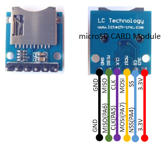

## 豊四季タイニーBASIC for Arduino STM32V0.86β

（注意）  
オリジナル版からリポジトリ管理を切り離しました。  
V0.85β版までは、下記のリポジトリにて管理しています。  
Tamakichi/ttbasic_arduino  https://github.com/Tamakichi/ttbasic_arduino  

     

本プログラムは、下記オリジナル版を[Arduino STM32](https://github.com/rogerclarkmelbourne/Arduino_STM32) 向けに移植・機能拡張版です.  
- オリジナル版配布サイト  
   https://github.com/vintagechips/ttbasic_arduino  
    関連情報 [電脳伝説 Vintagechips - 豊四季タイニーBASIC確定版](https://vintagechips.wordpress.com/2015/12/06/%E8%B1%8A%E5%9B%9B%E5%AD%A3%E3%82%BF%E3%82%A4%E3%83%8B%E3%83%BCbasic%E7%A2%BA%E5%AE%9A%E7%89%88/)

### 著作権について

**「豊四季 Tiny BASIC」**の著作権は開発者**のTetsuya Suzuki**氏にあります.  
プログラム利用については、オリジナル版の著作権者の配布条件に従うものとします.  
著作権者の同意なしに経済的な利益を得てはいけません.  
この条件のもとで、利用、複写、改編、再配布を認めます.    

### システム構成
  

#### 構成組み合わせパターン

上記構成で表示機器は排他選択となります。次の構成構成にてシステムを組むことが出来ます。 

  

##### 基本４構成の結線図

Blue Pillボードを利用した場合の上記①～④をベースとした結線図を示します。  
圧電スピーカーはオプションです。必要に応じて接続して下さい。  
RTC用バックアップ電池、SDカードモジュールも必要に応じて追加できます。  

###### ①ターミナルコンソール版

 

###### ②NTSC版

  

###### ③OLED版

**(1)OLED I2Cインタフェース版**

 

**(2)OLED SPIインタフェース版**

 

④TFT(ILI9341 320x240ドット)版

 

##### SDカードモジュールオプション

  
※5V・3.3V変換レギュレータが乗っている製品の場合、VCCは5Vを供給しないと動作しない場合があります。

##### RTC用バックアップ電池  オプション

  

#### ピン利用構成  

  

#### ボート上のピン一覧

 

#### 利用可能市販パーツ

- PS/2キーボード用コネクタ  
  ◾aitendo PS/2モジュール [ML-PS2-4P] http://www.aitendo.com/product/11377  
  ◾秋月電子 USBコネクタDIP化キット(Aメス) http://akizukidenshi.com/catalog/g/gK-07429/  

- NTSC用 RCAコネクタ  
  ◾aitendo TVOUTモジュールキット [K-TVOUT2R] http://www.aitendo.com/product/11740  
  ◾aitendo RCAモジュールキット [brebo.jam.rca] http://www.aitendo.com/product/12125  
  ◾秋月電子 RCAジャックDIP化キット(黄) http://akizukidenshi.com/catalog/g/gK-06522/  
  ※aitendo製品は付属抵抗を使うと若干出力電圧が上がりますが、許容範囲です。

- SDカードモジュール  
  amazon  
  ◾[EasyWordMall SDカードスロットソケットリーダーモジュールArduino用](https://www.amazon.co.jp/EasyWordMall-SD%E3%82%AB%E3%83%BC%E3%83%89%E3%82%B9%E3%83%AD%E3%83%83%E3%83%88%E3%82%BD%E3%82%B1%E3%83%83%E3%83%88%E3%83%AA%E3%83%BC%E3%83%80%E3%83%BC%E3%83%A2%E3%82%B8%E3%83%A5%E3%83%BC%E3%83%ABArduino%E7%94%A8/dp/B010PZZXNI/ref=cm_wl_huc_item)  
  ◾[Rasbee Micro SD/ TF カードモジュールシールド モジュール SPIインタフェース 1個](https://www.amazon.co.jp/Rasbee-Micro-%E3%82%AB%E3%83%BC%E3%83%89%E3%83%A2%E3%82%B8%E3%83%A5%E3%83%BC%E3%83%AB%E3%82%B7%E3%83%BC%E3%83%AB%E3%83%89-%E3%83%A2%E3%82%B8%E3%83%A5%E3%83%BC%E3%83%AB-SPI%E3%82%A4%E3%83%B3%E3%82%BF%E3%83%95%E3%82%A7%E3%83%BC%E3%82%B9/dp/B01KZBD6OA/ref=cm_wl_huc_item)  
  ◾[KKHMF マイクロSDストレージボード　TFカードシールドモジュール　SPIインタフェース Mega Due](https://www.amazon.co.jp/KKHMF-%E3%83%9E%E3%82%A4%E3%82%AF%E3%83%ADSD%E3%82%B9%E3%83%88%E3%83%AC%E3%83%BC%E3%82%B8%E3%83%9C%E3%83%BC%E3%83%89-TF%E3%82%AB%E3%83%BC%E3%83%89%E3%82%B7%E3%83%BC%E3%83%AB%E3%83%89%E3%83%A2%E3%82%B8%E3%83%A5%E3%83%BC%E3%83%AB-SPI%E3%82%A4%E3%83%B3%E3%82%BF%E3%83%95%E3%82%A7%E3%83%BC%E3%82%B9-Mega-Due/dp/B01G5AZ882/ref=cm_wl_huc_item)  
  ◾[ArduinoのためのマイクロSDカードモジュール](https://www.amazon.co.jp/GeeBot-Arduino%E3%81%AE%E3%81%9F%E3%82%81%E3%81%AE%E3%83%9E%E3%82%A4%E3%82%AF%E3%83%ADSD%E3%82%AB%E3%83%BC%E3%83%89%E3%83%A2%E3%82%B8%E3%83%A5%E3%83%BC%E3%83%AB/dp/B01GX126BU/ref=cm_wl_huc_item)  

  

- OLEDディスプレイモジュール(128x64ドット)  
  SSD1306、SSD1309、SH1106の３つのコントローラに対応  
  I2C、SPIに対応、サイズは1.3インチ以上を推奨  
  Aliexpress  
  ◾[1PCS 1.3" OLED module white color SPI 128X64 1.3 inch OLED](https://www.aliexpress.com/item/1PCS-1-3-OLED-module-white-color-SPI-128X64-1-3-inch-OLED-LCD-LED-Display/32681602908.html?spm=a2g0s.9042311.0.0.vs8i3e)  
  ◾[1PCS 1.3" OLED module white color I2C128X64 1.3 inch OLED](https://www.aliexpress.com/item/1PCS-1-3-OLED-module-white-color-128X64-1-3-inch-OLED-LCD-LED-Display-Module/32683739839.html?spm=a2g0s.9042311.0.0.vs8i3e)  

 

- TFT(ILI9341)ディスプレイモジュール  
  320x240ドット SPI接続  
  amazon  
  ◾[HiLetgo 2.8 "TFT LCDディスプレイ タッチパネル SPIシリアル240 * 320 ILI9341 5V / 3.3V](https://www.amazon.co.jp/HiLetgo-LCD%E3%83%87%E3%82%A3%E3%82%B9%E3%83%97%E3%83%AC%E3%82%A4-%E3%82%BF%E3%83%83%E3%83%81%E3%83%91%E3%83%8D%E3%83%AB-SPI%E3%82%B7%E3%83%AA%E3%82%A2%E3%83%AB240-ILI9341/dp/B072N551V3/ref=cm_wl_huc_item)  
  ◾[ディスプレーモジュール，SODIAL(R)2.2" TFT LCDディスプレーモジュール基板](https://www.amazon.co.jp/%E3%83%87%E3%82%A3%E3%82%B9%E3%83%97%E3%83%AC%E3%83%BC%E3%83%A2%E3%82%B8%E3%83%A5%E3%83%BC%E3%83%AB%EF%BC%8CSODIAL-LCD%E3%83%87%E3%82%A3%E3%82%B9%E3%83%97%E3%83%AC%E3%83%BC%E3%83%A2%E3%82%B8%E3%83%A5%E3%83%BC%E3%83%AB%E5%9F%BA%E6%9D%BF-240x320-ILI9341-PIC%E3%81%AE%E3%81%9F%E3%82%81-%E8%B5%A4/dp/B01DXBI3I8/ref=cm_wl_huc_item)  

 


### 本パッケージ・必要パッケージのダウンロードとインストール・配置
#### 本パッケージのダウンロードと配置
下記のリンクより直接ダウンロードして解凍、またはgitコマンドを使ってダウンロードして下さい。  

* ダウンロードリンク  
  https://github.com/Tamakichi/ttbasic_arduino_stm32/archive/master.zip

* gitを使ったダウンロード(複製のダウンロード)  
   ```
   git clone https://github.com/Tamakichi/ttbasic_arduino_stm32.git
   ```
  Windows 10へのgitの導入は、下記の手順を参考にして下さい。  
  * [git for Windowsのインストール手順](./docs/install_git.html)

ダウンロードした本パッケージのトップフォルダを 📁ttbasic_arduino_stm32\ とします。  
（解凍直後の *tbasic_arduino_stm32-master* から変更して下さい)  
トップフォルダを任意の場所に配置して下さい。  

#### 本パッケージの構成
📁ttbasic_arduino_stm32\  ・・・・ 本パッケージのトップフォルダ  
　📁bin\  ・・・・・・・・・・・・・ コンパイル済みスケッチ(ファームウェア)  
　📁docs\  ・・・・・・・・・・・・ドキュメント類(作成中)  
　📁hardware\    ・・・・・・・・・・Arduino STM32パッケージ配置場所  
　📁libraries\   ・・・・・・・・・・・ スケッチ用ライブラリ  
　📁ttbasic\  ・・・・・・・・・・・ スケッチ本体  
　📄manual.pdf  ・・・・・・・・・・ マニュアル(旧)    
　📄platform.local.txt  ・・・・・・・ コンパイルオプション定義(OLEDコントローラ指定用)  
　📄README.md    ・・・・・・・・・ 本ドキュメント  
　📄TinyBASIC早見表.pdf  ・・・・・・ チートシート(旧)  

Arduino IDEでスケッチをコンパイルする場合は、  
Arduino IDEの環境設定の **スケッチブックの保存場所** に 📁ttbasic_arduino_stm32\ を
設定して下さい。  
これにより、既存の環境・ライブラリとの干渉減らすことが出来ます。  

#### Arduino STM32パッケージのダウンロードと配置
Arduino STM32パッケージは、随時更新されているため動作確認した時点のスナップショットに 
不具合修正を行った、下記のパッケージをダウンロードして利用して下さい。  

* ダウンロードリンク  
  https://github.com/Tamakichi/Arduino_STM32/archive/master.zip

* gitを使ったダウンロード(複製のダウンロード)  
   ```
   git clone https://github.com/Tamakichi/Arduino_STM32.git
   ```

ダウンロードしたArduino STM32パッケージのトップフォルダを 📁Arduino_STM32\ とします。  
（解凍直後の *Arduino_STM32-master* から変更して下さい)  

Arduino STM32パッケージのトップフォルダは、📁hardware\の下に配置して下さい。    
　ğŸ“ttbasic_arduino_stm32\  
　　ğŸ“hardware\  
　　　ğŸ“Arduino_STM32\

#### STM32用USBドライバのインストール(Windows10環境)
Arduino STM32パッケージに添付のUSBドライバをインストールします。  

下記の📁win\📄install_drivers.basをクリックしてドライバをインストールします。    
　ğŸ“ttbasic_arduino_stm32\  
　　ğŸ“hardware\  
　　　ğŸ“Arduino_STM32\  
　　　　📁drivers\  
　　　　　📁win\  
　　　　　　📄install_drivers.bas

#### Java(JRE)実行環境のインストール
Arduino STM32パッケージのボート書き込みツールはJavaの実行環境が必要です。  
Javaをインストールしていない場合は、インストールして下さい。  
* 無料Javaのダウンロード https://java.com/ja/download/

### コンパイル済みスケッチ(ファームウェア) の利用
コンパイル済みスケッチ(ファームウェア) を用意しています。  
ファームウェアを直接マイコンボードに書き込んで利用することが出来ます。  

ファームウェア書込み手順(Windows 10の場合)  
プロジェクトファイルの**binフォルダ**に２つのタイプのファームウェアを用意しています。

1. ブートローダー無しファームウェア(バイナリー形式)  
ğŸ“ttbasic_arduino_stm32\  
　📁bin\  
　　📄black_medium_small_square:ttbasic_NTSC.bin	(NTSCビデオ出力版)  
　　📄black_medium_small_square:ttbasic_OLED_SH1106_I2C.bin	(OLED SH1106 I2C版)  
　　📄black_medium_small_square:ttbasic_OLED_SH1106_SPI.bin	(OLED SH1106 SPI版)  
　　📄black_medium_small_square:ttbasic_OLED_SSD1306_I2C.bin (OLEDSSD1306/SSD1309 I2C版)  
　　📄black_medium_small_square:ttbasic_OLED_SSD1306_SPI.bin (OLED SSD1306/SSD1309 SPI版)  
　　📄black_medium_small_square:ttbasic_Serial.bin (シリアルコンソール版)  
　　📄black_medium_small_square:ttbasic_TFT.bin	(TFT ILI9341版)  

2. ブートローダー付きファームウェア(バイナリー形式)  
ğŸ“ttbasic_arduino_stm32\  
　ğŸ“bin\PlusBootloader\  
　　📄boot_ttbasic_NTSC.bin	(NTSCビデオ出力版)  
　　📄boot_ttbasic_OLED_SH1106_I2C.bin (OLED SH1106 I2C版)  
　　📄boot_ttbasic_OLED_SH1106_SPI.bin (OLED SH1106 SPI版)  
　　📄boot_ttbasic_OLED_SSD1306_I2C.bin (OLED SSD1306/SSD1309 I2C版)  
　　📄boot_ttbasic_OLED_SSD1306_SPI.bin (OLED SSD1306/SSD1309 SPI版)  
　　📄boot_ttbasic_Serial.bin	(ターミナルコンソール版)  
　　📄boot_ttbasic_TFT.bin (TFT ILI9341版)  

#### ブートローダー無しファームウェア(バイナリー形式)の書込み手順(Windows10環境)
利用するマイコンボードにArduino STM32用のブートローダーが書き込まれている必要があります。  
BluePillボードへの書き込みは下記の記事等を参考して行って下さい。  

* [BluePillボードへのブートローダの書き込み(本パッケージ添付ドキュメント)](./docs/install.html#_bluepillボードへのブートローダの書き込み)
* DEKOのアヤシいお部屋-「STM32F103C8T6」http://ht-deko.com/arduino/stm32f103c8t6.html  

##### ファームウェア書込み手順
1. `ttwrite.bat`の修正  
   ```
   set dev=COM4
   ・・・
   ```
   `dev`にマイコンボードのUSBポートが利用するシリアルポートを指定します。  
   `COM`は必ず半角大文字で記述して下さい。  

2. コマンドプロンプト上でコマンド実行  
   コマンドプロンプトを起動します。  
   📁ttbasic_arduino_stm32\📁bin\ に移動し、次のコマンドを実行します。  

   ```
   ttwrite ブートローダー無しファームウェアファイル
   ```
    指定する **ブートローダー無しファームウェアファイル** は各自の利用目的に応じてで選択して下さい。  

   `ttwrite ttbasic_TFT.bin`を実行した例：  
   ```
   ttwrite ttwrite ttbasic_TFT.bin
   ```

     

   コマンド実行しても書き込みが開始されない場合、ボード上のリセットボタンを押すことで、  
   ブートローダーが強制的に書込みモードに切り替わります。試してみて下さい。  


   別の方法として、エクスプローラー上で`ttwrite.bat`アイコン上に**ブートローダー無しファームウェアファイル**のアイコンをドラック＆ドロップすることで書き込むことが出来ます。  

      

#### ブートローダー付きファームウェア(バイナリー形式) の書込み手順

ブートローダーと同じ方法で書き込むこと出来ます。  
(プログラマST-LINKのを使って、STM32 ST-LINK Utilityで書き込み)  

ここでは添付のttbtwrite.batコマンドを使ったシリアル接続による方法を説明します。  

##### 事前準備
 

1. USB-シリアル変換モジュールを用意して下さい。  
  パソコンに接続して接続するシリアルポートを確認します。  
  ここでは、COM5とします。

2. 添付の書込み用バッチファイルttbtwrite.batを各自の環境に合わせて修正します。  
ğŸ“bin\PlusBootloader\  
　📄stm32flash.exe ・・ stm32flash(Arduino STM32に付属のもとの同じプログラムです)  
　📄ttbtwrite.bat   ・・・ 書込み用バッチファイル  

   ```
   set dev=COM5
   stm32flash.exe -b 115200 -f -v -w %1 %dev%
   ```
   devのシリアルポートの指定を各自の環境に合わせて変更して下さい。  

3. BluePillボードのUSBポートを電源供給を兼ねてパソコンに接続します。  
4. USB-シリアル変換モジュールとBlue Pillボード結線します。  　

   | USB-シリアル変換モジュール | Blue Pillボード |
   | :-------------: | :----------: |
   |       GND       |     GND      |
   |       TXD       |     A10      |
   |       RXD       |      A9      |

5. ジャンパースイッチの設定ボード上のBOOT0ジャンパを1に設定します。  
      
   **BOOT0**：1  
   **BOOT1**：0  

##### 書込み作業
コマンドプロンプトを実行します。  
**ttbtwrite.bat**のある📁bin\PlusBootloader\ に移動し、次のコマンドを実行します。  
```
ttbtwrite ブートローダー付きファームウェアファイル
```
**ブートローダー付きファームウェアファイル**は同じフォルダ内にあります。  
各自の用途に合わせて指定して下さい。  

`ttbtwrite boot_ttbasic_Serial.bin` を実行した例：  
```
ttbtwrite ttbtwrite boot_ttbasic_Serial.bin
```
 

書込みはエクスプローラー上で**ブートローダー付きファームウェアファイル**のアイコンを**ttbtwrite.bat**のアイコンにドラック＆ドロップする操作でも行うことが出来ます。  
   

書込みが完了したら、BOOT0ジャンバを0に戻して下さい。  

### スケッチの書込み手順
スケッチをコンパイルして書き込む場合の手順です。  
スケッチは下記のフォルダのttbasic.inoが本体です。      
　ğŸ“ttbasic_arduino_stm32\
　　📁ttbasic\
　　　📄ttbasic.ino

#### 事前準備
1. Arduino IDEのスケッチ保存場所の設定  
  Arduino IDEの環境設定の **スケッチブックの保存場所** に 
  📁ttbasic_arduino_stm32\ を設定して下さい。  
  設定反映のため一旦Arduino IDE終了し、再度Arduino IDEを起動して下さい。

2. Arduino IDEのボードマネージャにて  
「Arduino SAMD Boards (32-bits ARM Coetex-M0+) by Arduino」の  
最新版をインストールして下さい。

3. Arduino IDEのボードの設定  
Arduinoのメニューでボードの設定を行います。  
    * ボード： Generic STM32F103C series  
    * Variant： Generic STM32F103C8(20k RAM 128k Flash)  
    * Upload method： STM32duino bootloader  
    * CPU Speed： 72MHz
    * Optimize： Smallest
    * Upload method: "STM32duino bootloader" ※各自環境に合わせて任意  
    * シリアルポート: ※各自環境に合わせて任意  

4. STM32用USBドライバをインストールしているものとします。

上記の設定の詳細については、本パッケージ添付の下記のドキュメントも参照下さい。
* [Arduino IDEの環境設定](./docs/install.html#_arduino_ide%E3%81%AE%E7%92%B0%E5%A2%83%E8%A8%AD%E5%AE%9A)

#### システム構成別の修正

デフォルトでは、**基本4構成の②NTSC版(SDカードあり)の設定**となっています。  
異なるシステム構成で利用する場合は、それぞれに必要な修正を行って下さい。

##### ①ターミナルコンソール版
1. `tconfig.h`の修正
- ` USE_SCREEN_MODE`の値`1`を`0`に変更して下さい.
  ```
  #define USE_SCREEN_MODE 0 //※デバイススクリーン利用の場合、1を指定する (デフォルト:1)
  ```
- `USE_NTSC`の値`1`を`0`に変更して下さい.
  ```
  #define USE_NTSC  1  // 0:利用しない 1:利用する (デフォルト:1)
  ```

##### ②OLED版
1. `tconfig.h`の修正
- `USE_NTSC`の値`1`を`0`に変更して下さい.  
  ````
  #define USE_NTSC  0  // 0:利用しない 1:利用する (デフォルト:1)
  ````
 - `USE_OLED`の値`0`を`1`に変更して下さい.  
   `OLED_IFMODE`の値をI2C接続の場合`0`、SPI接続の場合`1`を指定して下さい.  
   必要に応じて、画面の向き`OLED_RTMODE`を変更して下さい。  

     ````cpp
   #define USE_OLED     1 // 0:利用しない 1:利用する (デフォルト:0)
                         // 利用時は USE_NTSC を0にすること
   #define OLED_IFMODE 1 // OLED接続モード(0:I2C 1:SPI デオフォルト:1 )
   #define OLED_SCMODE 1 // スクリーンモード(1～6 デオフォルト:1 )
   #define OLED_RTMODE 0 // 画面の向き (0～3: デフォルト: 0)
     ````

2. **コントローラの選択**  
   デフォルトでは、SH1106 対応となっています。  
   利用するコントローラをSSD1306/SSD1309に変更する場合、  
   利用するライブラリを切り替える必要があります。  
   この切り替えは、Arduinoのコンパイル条件指定を行う **platform.local.txt**
   ファイルにて指定します。

   本パッケージ添付の  **platform.local.txt** ファイル   
  ğŸ“ttbasic_arduino_stm32\   
  　📄platform.local.txt

   を下記のフォルダに配置して下さい(STM32F1の下)  
  ğŸ“ttbasic_arduino_stm32\  
  　ğŸ“hardware\  
  　　ğŸ“Arduino_STM32\  
  　　　📁STM32F1\  
  　　　　📄platform.local.txt
  
    **platform.local.txt** は次のような定義となっています。  
     ```TXT
    # These can be overridden in platform.local.txt
    # OLED_DEV: 0 SH1106、 1 SSD1306/SSD1309
    compiler.c.extra_flags=-DOLED_DEV=1
    compiler.cpp.extra_flags=-DOLED_DEV=1
     ```
    OLED_DEVの値を変更することでもSH1106、SSD1306/SSD1309の切り替えを行うことが出来ます。  

##### ③TFT(ILI9341 320x240ドット)版  
1. `tconfig.h`の修正  
  `USE_NTSC`の値`1`を`0`に変更して下さい.  
      ```cpp
    #define USE_NTSC  0  // 0:利用しない 1:利用する (デフォルト:1)
      ```

    `USE_TFT`の値`0`を`1`に修正して下さい.  
    必要に応じて、画面の向き`TFT_RTMODE`を変更して下さい。  

    ```CPP
    #define USE_TFT     1 // 0:利用しない 1:利用する (デフォルト:0)
                          // 利用時は USE_NTSC を0にすること
    #define TFT_SCMODE 1  // スクリーンモード(1～6 デオフォルト:1 )
    #define TFT_RTMODE 3  // 画面の向き (0～3: デフォルト: 3)
    ```

#### スケッチの書込み
Arduno IDEの「⇒」アイコンまたは、メニュー [スケッチ] > [マイコンボードに書き込む]にて  
スケッチを書き込みます。

### サンプルプログラム
#### ボード上のLEDの点滅  
```
10 P=PC13
20 GPIO P,OUTPUT
30 OUT P,HIGH
40 FOR I=1 TO 10
50 OUT P,LOW
60 WAIT 300
70 OUT P,HIGH
80 WAIT 300
90 NEXT I
```

#### アナログ値表示
```
10 CLS
20 GPIO PB1,ANALOG
30 A=ANA(PB1)
40 LOCATE 5,5: ? A; "     "
50 GOTO 30
```
#### 配列の連続設定
```
10 @(1)=1,2,3,4,5,6,7,8
20 FOR I=1 TO 8
30 ? "@(";I;")=";@(I)
40 NEXT I
```

#### シフト演算
```
10 A=1
20 FOR I=0 TO 16
30 ? HEX$(A<<I,4)
40 NEXT I
```

#### ラベルの利用
```
100 GOSUB "SUB01"
110 GOSUB "SUB02"
120 N=0
130 "LOOP"
140 PRINT "N=";N
150 N=N+1:IF N<5 GOTO "LOOP"
160 END
170 "SUB01"
180 PRINT "SUB01"
190 RETURN
200 "SUB02"
210 PRINT "SUB02"
220 RETURN
```

## 以降はオリジナルのドキュメントです


TOYOSHIKI Tiny BASIC for Arduino

The code tested in Arduino Uno R3.<br>
Use UART terminal, or temporarily use Arduino IDE serial monitor.

Operation example

&gt; list<br>
10 FOR I=2 TO -2 STEP -1; GOSUB 100; NEXT I<br>
20 STOP<br>
100 REM Subroutine<br>
110 PRINT ABS(I); RETURN

OK<br>
&gt;run<br>
2<br>
1<br>
0<br>
1<br>
2

OK<br>
&gt;

The grammar is the same as<br>
PALO ALTO TinyBASIC by Li-Chen Wang<br>
Except 3 point to show below.

(1)The contracted form of the description is invalid.

(2)Force abort key<br>
PALO ALTO TinyBASIC -> [Ctrl]+[C]<br>
TOYOSHIKI TinyBASIC -> [ESC]<br>
NOTE: Probably, there is no input means in serial monitor.

(3)Other some beyond my expectations.

(C)2012 Tetsuya Suzuki<br>

